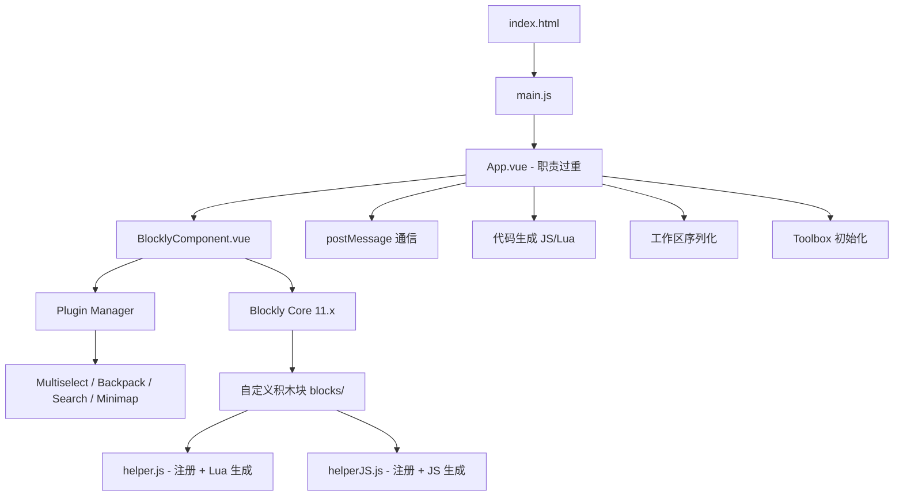
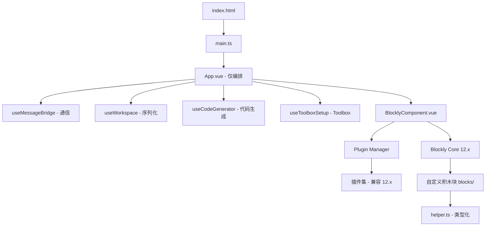

# 技术设计文档：blockly-vue3 项目升级改进

## 概述

本设计文档描述 blockly-vue3 项目的系统性升级方案。blockly-vue3 是一个嵌入在 iframe 中的 Blockly 可视化编程编辑器，通过 postMessage 与父窗口通信，为 7D Game 平台提供脚本编辑能力。

本次升级涵盖 9 个方面：构建工具链升级 (Vite 2→5+)、测试覆盖补全、ESLint 规则修复、TypeScript 渐进引入、App.vue 职责拆分、Dockerfile 构建修复、工作区加载机制重构、移除 Dev Server CORS 配置、以及 Blockly 11→12 升级。

升级策略遵循"先基础设施，后业务逻辑"的原则：先完成构建工具链和 Blockly 核心升级，再进行代码质量改进和架构重构。

## 架构

### 当前架构



### 升级后架构



### 升级执行顺序

由于各需求之间存在依赖关系，建议按以下顺序执行：

1. **需求 1** - Vite 升级（基础设施，其他所有需求依赖构建系统正常工作）
2. **需求 9** - Blockly 升级（核心依赖，影响积木块定义和代码生成）
3. **需求 6** - Dockerfile 修复（独立，可与上述并行）
4. **需求 8** - 移除 CORS 配置（独立，简单删除）
5. **需求 3** - ESLint 规则修复（代码质量基础）
6. **需求 4** - TypeScript 引入（需要构建系统已就绪）
7. **需求 5** - App.vue 拆分（架构重构，需要 TS 支持）
8. **需求 7** - 工作区加载重构（依赖 App.vue 拆分后的 useWorkspace）
9. **需求 2** - 测试覆盖补全（最后执行，确保测试的是最终代码）

## 组件与接口

### 需求 1：构建工具链升级

**变更文件：**
- `package.json` — 升级 vite、@vitejs/plugin-vue、vite-plugin-static-copy 版本
- `vite.config.js` — 适配 Vite 5.x API 变更

**版本映射：**
| 包名 | 当前版本 | 目标版本 |
|------|---------|---------|
| vite | ^2.9.18 | ^5.4.0 |
| @vitejs/plugin-vue | ^2.3.4 | ^5.1.0 |
| vite-plugin-static-copy | ^0.6.1 | ^2.2.0 |

**关键变更点：**
- Vite 5 要求 Node.js >= 18（当前 Dockerfile 使用 node:22-alpine，满足要求）
- `vite-plugin-static-copy` 的 `targets` 配置 API 在 v1.0+ 有变更，`src` 字段改为使用 glob 模式
- `@vitejs/plugin-vue` v5 与 Vite 5 配套，API 基本兼容

### 需求 2：测试覆盖补全

**新增测试文件：**
- `src/__tests__/blocks/helper.test.ts` — RegisterData、Handler、各类参数生成函数
- `src/__tests__/blocks/code-generation.test.ts` — 积木块 JS/Lua 代码生成
- `src/__tests__/composables/useMessageBridge.test.ts` — postMessage 通信逻辑
- `src/__tests__/composables/useWorkspace.test.ts` — 工作区序列化/反序列化
- `src/__tests__/utils/Access.test.ts` — 角色判断和权限检查
- `src/__tests__/utils/dataUpgrade.test.ts` — 数据升级逻辑

**删除文件：**
- `src/__tests__/example.test.js` — 占位测试

**测试策略：**
- 使用 Vitest 作为测试框架
- 使用 fast-check 作为属性测试库
- 对 Blockly 相关测试，mock `blockly` 模块避免 DOM 依赖
- 对 postMessage 测试，mock `window.parent.postMessage`

### 需求 3：ESLint 规则修复

**变更文件：**
- `.eslintrc.cjs` — 将 `no-unused-vars`、`no-empty-function`、`no-empty-pattern` 从 "off" 改为 "warn"
- 各源文件 — 对合理的警告添加行内 `// eslint-disable-next-line` 注释并注明原因

### 需求 4：TypeScript 引入

**新增文件：**
- `tsconfig.json` — TypeScript 配置
- `src/utils/Access.ts` — 从 Access.js 迁移
- `src/blocks/helper.ts` — 从 helper.js 迁移

**tsconfig.json 关键配置：**
```json
{
  "compilerOptions": {
    "target": "ES2020",
    "module": "ESNext",
    "moduleResolution": "bundler",
    "allowJs": true,
    "strict": false,
    "jsx": "preserve",
    "resolveJsonModule": true,
    "isolatedModules": true,
    "esModuleInterop": true,
    "lib": ["ES2020", "DOM", "DOM.Iterable"],
    "skipLibCheck": true,
    "noEmit": true,
    "paths": {
      "@/*": ["./src/*"]
    }
  },
  "include": ["src/**/*.ts", "src/**/*.d.ts", "src/**/*.vue"],
  "exclude": ["node_modules"]
}
```

**删除文件：**
- `src/utils/Access.js` — 迁移为 .ts 后删除
- `src/blocks/helper.js` — 迁移为 .ts 后删除

### 需求 5：App.vue 职责拆分

**新增 Composable 模块：**

```
src/composables/
├── useMessageBridge.ts   — postMessage 通信
├── useWorkspace.ts       — 工作区序列化/反序列化/加载
├── useCodeGenerator.ts   — JS/Lua 代码生成
└── useToolboxSetup.ts    — Toolbox 初始化配置
```

**useMessageBridge 接口：**
```typescript
interface UseMessageBridge {
  handleMessage(event: MessageEvent): void
  postMessage(action: string, data?: Record<string, unknown>): void
  onAction(action: string, handler: (data: any) => void): void
}
```

**useWorkspace 接口：**
```typescript
interface UseWorkspace {
  saveWorkspace(workspace: Blockly.WorkspaceSvg): object
  loadWorkspace(workspace: Blockly.WorkspaceSvg, data: object): void
  watchWorkspaceReady(
    workspaceRef: Ref<Blockly.WorkspaceSvg | null>,
    onReady: (ws: Blockly.WorkspaceSvg) => void
  ): void
}
```

**useCodeGenerator 接口：**
```typescript
interface UseCodeGenerator {
  generateJavaScript(workspace: Blockly.WorkspaceSvg): string
  generateLua(workspace: Blockly.WorkspaceSvg): string
  generateAll(workspace: Blockly.WorkspaceSvg): { js: string; lua: string }
}
```

**useToolboxSetup 接口：**
```typescript
interface UseToolboxSetup {
  buildToolbox(style: string[], parameters: object, access: Access): object
  getDefaultOptions(toolbox: object): Blockly.BlocklyOptions
}
```

### 需求 6：Dockerfile 构建修复

**变更文件：** `Dockerfile`

**修复后的 Dockerfile：**
```dockerfile
FROM node:22-alpine AS build
WORKDIR /app
COPY package.json pnpm-lock.yaml ./
RUN npm install pnpm -g
RUN pnpm install --frozen-lockfile
COPY . .
RUN pnpm run build

FROM nginx:1.19.0-alpine AS prod-stage
COPY --from=build /app/dist /usr/share/nginx/html
EXPOSE 80
CMD ["nginx","-g","daemon off;"]
```

**关键变更：**
- 将 `pnpm-lock.yaml` 与 `package.json` 一起 COPY，在 `COPY . .` 之前
- 使用 `--frozen-lockfile` 确保严格按 lockfile 安装

### 需求 7：工作区加载机制重构

**当前问题：** App.vue 中的 `loadWorkspace` 函数使用 `setTimeout` 轮询（最多 100 次，每次 50ms）等待 workspace 就绪。

**重构方案：** 使用 Vue 的 `watch` 监听 workspace ref 的变化，当 workspace 变为非 null 时立即加载数据。

```typescript
// useWorkspace.ts 中的实现思路
function watchWorkspaceReady(
  workspaceRef: Ref<Blockly.WorkspaceSvg | null>,
  onReady: (ws: Blockly.WorkspaceSvg) => void
) {
  const stopWatch = watch(
    workspaceRef,
    (ws) => {
      if (ws) {
        onReady(ws)
        stopWatch()
      }
    },
    { immediate: true }
  )

  // 超时保护：5 秒后如果仍未就绪，记录错误
  const timeout = setTimeout(() => {
    if (!workspaceRef.value) {
      console.error('Blockly workspace failed to initialize within 5s')
      postMessage('error', { message: 'workspace-init-timeout' })
      stopWatch()
    }
  }, 5000)

  // 清理
  onBeforeUnmount(() => {
    clearTimeout(timeout)
    stopWatch()
  })
}
```

### 需求 8：移除 Dev Server CORS 配置

**变更文件：** `vite.config.js`

删除 `vite.config.js` 中整个 `server.cors` 配置块（包含 origin: "*"、methods、allowedHeaders、credentials），保持 Vite 默认行为。纯前端项目不需要在 dev server 上配置 CORS。

### 需求 9：Blockly 升级

**版本映射：**
| 包名 | 当前版本 | 目标版本 |
|------|---------|---------|
| blockly | ^11.2.2 | ^12.2.0 |
| @blockly/field-colour | ^5.0.19 | ^6.0.0 |
| @blockly/field-multilineinput | ^6.0.5 | ^7.0.0 |
| @blockly/plugin-workspace-search | 9.0.1 | ^10.0.0 |
| @blockly/workspace-backpack | ^7.0.6 | ^8.0.0 |
| @blockly/workspace-minimap | ^0.3.5 | ^0.4.0 |
| @mit-app-inventor/blockly-plugin-workspace-multiselect | ^1.0.2 | 需评估兼容性 |

**Blockly 12.x 主要 Breaking Changes 需关注：**
- `Blockly.Names.NameType` 可能有变更，影响 `src/custom/index.js` 中的 procedure 生成器
- `blockly/javascript` 和 `blockly/lua` 的导入路径可能变更
- `Blockly.Blocks[name]` 注册方式可能有变化
- `generator.ORDER_*` 常量可能有调整
- `Blockly.setLocale()` API 可能有变更

**风险点：**
- `@mit-app-inventor/blockly-plugin-workspace-multiselect` 是第三方社区插件，可能尚未适配 Blockly 12.x。如不兼容，需临时禁用并记录 TODO。

## 数据模型

### Blockly 工作区数据格式

工作区数据通过 `Blockly.serialization.workspaces.save/load` 进行序列化/反序列化，格式为 JSON：

```typescript
interface WorkspaceData {
  blocks: {
    languageVersion: number
    blocks: BlockData[]
  }
  variables?: VariableData[]
}

interface BlockData {
  type: string
  id: string
  x?: number
  y?: number
  fields?: Record<string, any>
  inputs?: Record<string, InputData>
  next?: { block: BlockData }
  extraState?: any
}

interface InputData {
  block?: BlockData
  shadow?: BlockData
}

interface VariableData {
  name: string
  id: string
  type?: string
}
```

### Access 权限模型

```typescript
type Role = 'root' | 'admin' | 'manager' | 'user' | 'guest'

interface UserInfo {
  id: string
  role: Role
}

// 角色权重（从低到高）：guest < user < manager < admin < root
```

### postMessage 通信协议

```typescript
interface PostMessagePayload {
  action: string
  data: Record<string, unknown>
  from: string  // 'script.blockly' | 'script.meta.web' | 'script.verse.web'
}

// 入站消息 (从父窗口)：
// - action: 'init'      → data: { style, parameters, data }
// - action: 'user-info' → data: { id, role }
// - action: 'save'      → data: {}

// 出站消息 (到父窗口)：
// - action: 'ready'     → data: {}
// - action: 'post'      → data: { js, lua, data }
// - action: 'post:no-change' → data: {}
// - action: 'update'    → data: { lua, js, blocklyData }
// - action: 'error'     → data: { message }
```

### Block 定义模式

每个自定义积木块遵循统一的定义模式：

```typescript
interface BlockDefinition {
  title: string
  type: string
  getBlock(parameters: object): { init(): void }
  getJavascript(parameters: object): (block: any, generator: any) => [string, number] | string
  getLua(parameters: object): (block: any, generator: any) => [string, number] | string
  toolbox: object
}
```
