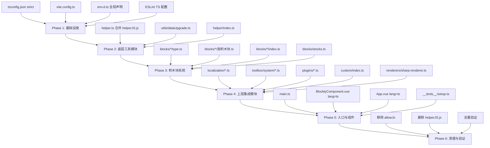
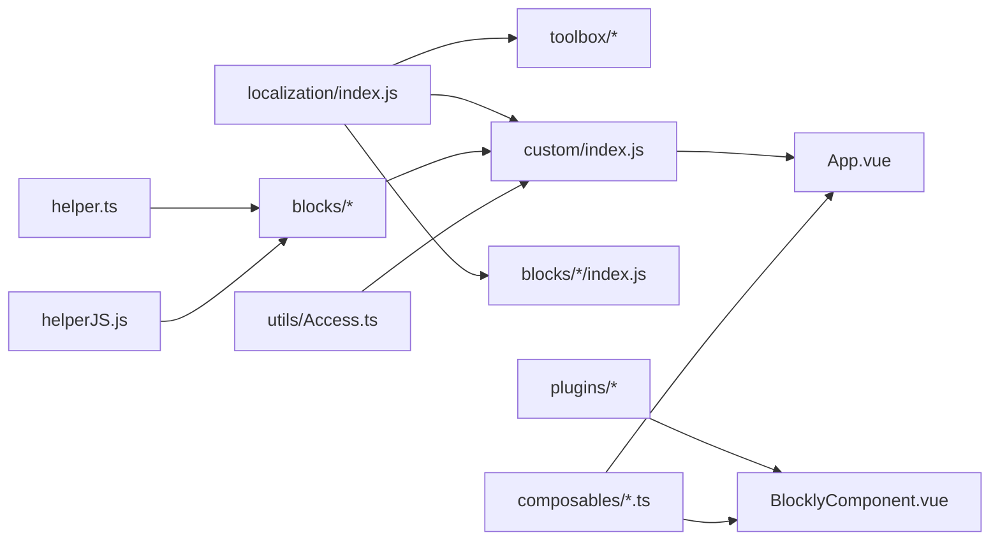

# 技术设计文档：TypeScript 迁移

## 概述

本设计文档描述将 Vue 3 + Blockly 可视化脚本编辑器项目从 JavaScript 完全迁移到 TypeScript 的技术方案。

项目当前状态：
- **已使用 TypeScript 的部分**：5 个 composables（`.ts`）、`src/blocks/helper.ts`、`src/utils/Access.ts`、所有测试文件（`.test.ts`）
- **待迁移的 JS 文件**：约 80+ 个 `.js` 文件，分布在 `src/blocks/`（19 个子目录 + 2 个根文件）、`src/plugins/`（3 个文件）、`src/localization/`（3 个文件）、`src/toolbox/system/`（6 个文件）、`src/custom/`（1 个文件）、`src/utils/`（1 个文件）、`src/helper/`（1 个文件）、`src/renderers/`（1 个文件）、`src/__tests__/setup.js`、`src/main.js`
- **配置文件**：`vite.config.js` 需迁移为 `.ts`；`tsconfig.json` 需升级为 strict 模式
- **构建工具**：Vite 5 + Vue 3.5 + Blockly 12
- **测试框架**：Vitest + fast-check（已有属性测试）

迁移核心策略是**渐进式、模块化迁移**：按模块依赖顺序逐步转换，确保每一步都能通过构建和测试。

## 架构

### 迁移顺序策略

迁移遵循**自底向上**的依赖顺序，确保被依赖的模块先完成迁移：



### 依赖关系分析



## 组件与接口

### 1. 全局类型声明（`src/env.d.ts`）

新建全局类型声明文件，解决 `window.lg`、`__BUILD_TIME__`、Vue SFC 模块声明和缺少类型的第三方库：

```typescript
/// <reference types="vite/client" />

// Vue 单文件组件模块声明
declare module '*.vue' {
  import type { DefineComponent } from 'vue'
  const component: DefineComponent<object, object, unknown>
  export default component
}

// Vite define 注入的全局常量
declare const __BUILD_TIME__: string

// 扩展 Window 接口
interface Window {
  lg: string
  URL: typeof URL
  BlobBuilder: unknown
  webkitURL?: typeof URL
  WebKitBlobBuilder?: unknown
  MozBlobBuilder?: unknown
}

// 缺少类型声明的第三方模块
declare module '@mit-app-inventor/blockly-plugin-workspace-multiselect' {
  import type Blockly from 'blockly'
  export class Multiselect {
    constructor(workspace: Blockly.WorkspaceSvg)
    init(options?: Record<string, unknown>): void
  }
}
